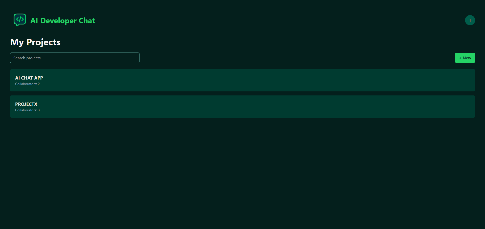
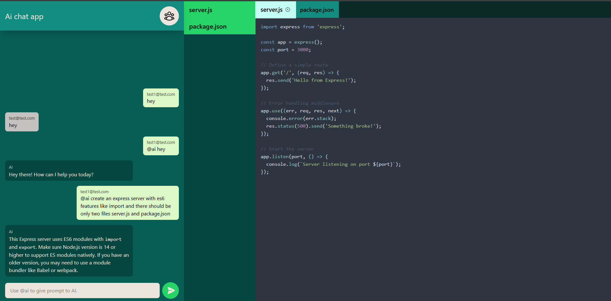
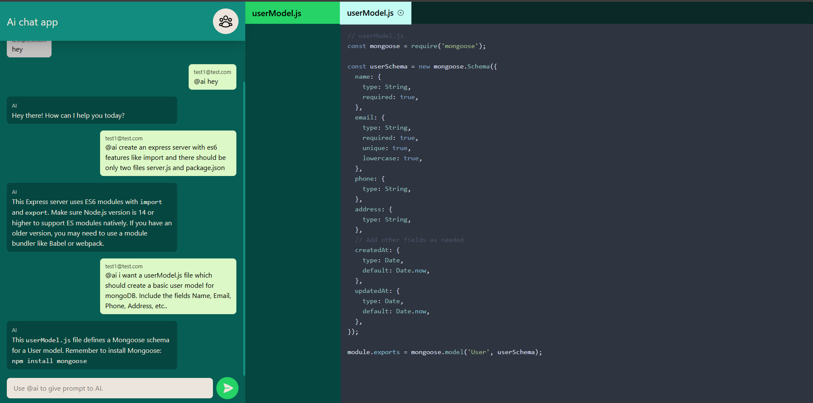
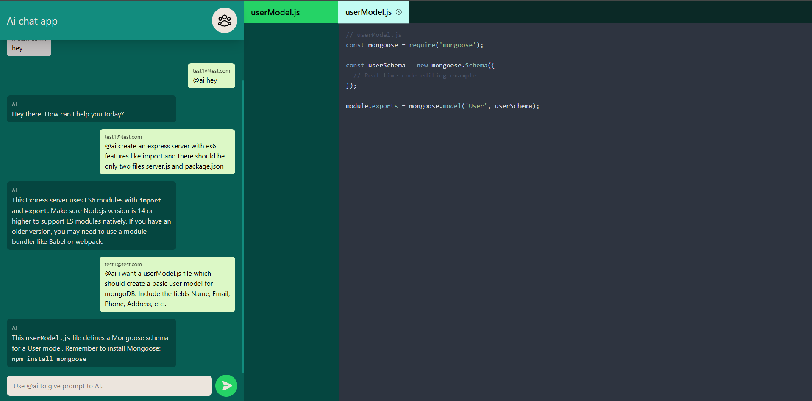

# AI-DevChatApp

## Introduction

AI-DevChatApp is a **real-time collaborative chat application for developers** that allows users to:

- **Login and manage projects** they are working on.
- **Invite collaborators** to join their projects.
- **Chat with team members** using real-time messaging powered by **Socket.io**.
- **Integrate AI assistance** by using the `@ai` keyword in chats.
- **Receive AI-generated file structures** with code snippets.
- **View and edit code** directly inside an **integrated code editor**.

This project is built using **MongoDB, Express.js, React (Vite), and Node.js (MERN stack)** with **Socket.io** for real-time communication.

### **Live Demo:** [AI-DevChatApp](https://ai-dev-chat.vercel.app/)

---

## 🚀 Installation & Usage

Follow these steps to set up the project locally:

### **1. Clone the Repository**

```sh
git clone https://github.com/MukulTiwari02/AI-DevChatApp.git
cd AI-DevChatApp
```

### **2. Setup Backend**

```sh
cd backend
npm install
```

Create a `.env` file in the **backend** folder and add the following environment variables:
  ```env
  MONGO_URI=your_mongodb_connection_string
  JWT_SECRET=your_jwt_secret_key
  PORT=your_backend_port
  GEMINI_API_KEY=your_google_gemini_api_key
  ```
Start the backend server:

```sh
npm start
```

### **3. Setup Frontend**
Note: Run frontend in a new/separate terminal
```sh
cd frontend
npm install
```

Create a `.env` file in the **frontend** folder and add the following environment variable:
  ```env
  VITE_API_URL=your_backend_api_url
  ```
Start the frontend server:

```sh
npm run dev
```

### **4. Open the App**

Once both backend and frontend are running, open [http://localhost:5173](http://localhost:5173) in your browser.

---

## 🎥 Project Demo

[**Live Demo Link**](https://ai-dev-chat.vercel.app/)

### **1. User Authentication**
Users can register and log in to access the application securely.


### **2. Project Management**
Users can create projects, and add collaborators to work together.

 


### **3. Real-Time Chat**
Developers can communicate with project collaborators using real-time messaging powered by Socket.io.


### **4. AI-Assisted Coding**
Using the @ai keyword, developers can generate AI-powered code suggestions and file structures.




### **6. Live Code Collaboration**



---

## 📜 Tech Stack

- **Frontend**: React (Vite), TailwindCSS, React Router
- **Backend**: Node.js, Express.js, MongoDB, Mongoose
- **Real-Time**: Socket.io
- **AI Integration**: Google Generative AI API
- **Authentication**: JWT, bcrypt, cookie-parser
- **Hosting**: Vercel (Frontend), Railway.app (Backend)

---

## 📌 Features

✅ **User Authentication** (JWT-based login/logout)  
✅ **Project & Collaboration Management**  
✅ **Real-time Chat (Socket.io)**  
✅ **AI-Powered Chat Responses** (`@ai` keyword)  
✅ **File Tree & Code Editor Integration**  
✅ **Live Code Editing for Collaborators**  
✅ **Modern UI with TailwindCSS**  

---

## 📬 Contributions & Support

Feel free to fork this repository and submit pull requests for improvements! If you encounter any issues, open an issue on GitHub.

---

